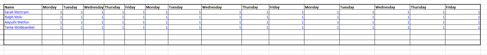

# Yesterday's Weather Forecasting Pattern

We have used this tool to analyze the team's progress by generating
yesterday\'s weather of Sprint 1 and Sprint 2 used the data to forecast
Sprint 3 capacity.

Calculation Explanation:
-----------------------------------------------------------------------
  **Theoretical capacity**: If all members of the team are available as planned (0 = not available, 1 = fully available).
  
  **Actual Capacity**: It's the sum of Actual Availability of each team member.
  
  **Team Capacity**: The percentage of Actual Capacity.
  
  **Assumed Normalized Velocity**: Normalized velocity is calculated as the number of points completed in a Sprint, divided by the percent team capacity in that Sprint.
  
  **Sprint Buffer**: The percentage of velocity to be reserved for unplanned stories that come up during the sprint.

  **Targeted points**: The team\'s \"percent capacity\" for the upcoming Sprint is displayed and the number of points (excluding buffer) that the team should bring into the Sprint.

  -----------------------------------------------------------------------

**Table.1. Showing the availability of team on the regular basis**

\

**Table.2. Showing the rationale for upcoming Sprint**

**Targeted points is the Forecast of the number of Story Points
deliverable in Sprint 3 based on Yesterday's Weather Forecast.**

**Steps for using this Tool:**

-   Enter the names of each team member in \"Column B."

-   Enter the fraction of each working day that each team member should
    be available to the team on a regular basis in cells C2 to Q6/ (0 =
    not available, 1 = fully available)

-   Type the number shown in cell T3, which is currently your
    \"theoretical capacity\" (if all team members are available as
    planned) into cell T4 At each Sprint Planning Meeting...

-   In Cells C2 to Q6, update the percent availability for each team
    member to reflect any known vacation, illness, etc. for the upcoming
    Sprint.

-   Enter the average \"normalized\" velocity from the past three
    Sprints in Cell T6. Normalized velocity is calculated as the number
    of points completed in a Sprint, divided by the percent team
    capacity in that Sprint.

-   Enter the team\'s current \"buffer\" (the percentage of velocity to
    be reserved for unplanned stories that come up during the sprint) in
    Cell T7

-   The team\'s \"percent capacity\" for the upcoming Sprint is
    displayed in Cell T5, and the number of points (excluding buffer)
    that the team should bring into the Sprint is shown in Cell T7. **\
    \
    \
    Tool Reference:** https://www.scruminc.com/
